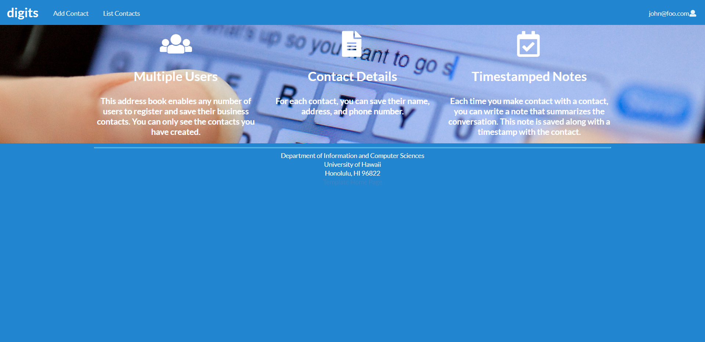

Install:

1.Clone the "digits" repository to your GitHub Desktop
2.Open command prompt and change directories into app directory in digits
3.Run "meteor npm install"
4.Run "meteor npm run start" and then go to "http://localhost:3000/" to see website

Pages:

-Landing Page:
First page you visit when entering the website and provides general information about the website and its functions.

-Sign in/Sign up Page:
Page where you can create an account for digits or sign into an existing account you already have. There are two types of users, regular users and admin who have special site privelages.

-Add Contact Page:
Page that allows you to add a contact to your accounts list of contacts by entering the contacts name, address, description, etc...

-List Contacts:
Page shows all contacts connected to the current accout you are logged into allowing you to add notes to contact and edit them.
